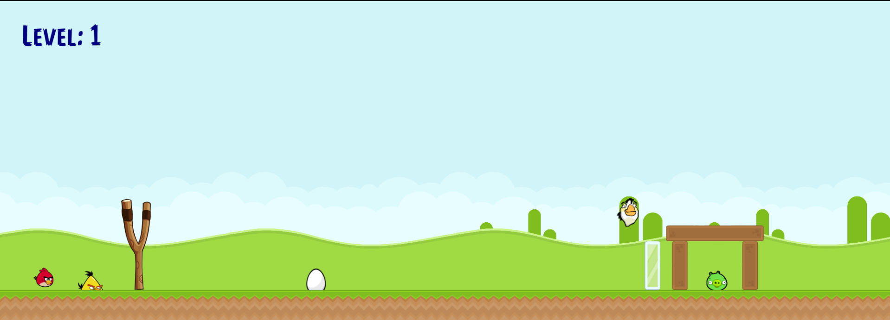

# Angry-Birds

## Overview

The Angry Birds Game is a JavaScript-based 2D physics game inspired by the popular Angry Birds franchise. Players use a slingshot to launch birds at structures and pigs with the objective of destroying all the pigs and scoring points. The game incorporates unique bird abilities, different pig types, and interactive gameplay elements.

## Features

- Slingshot Mechanics: Launch birds by dragging and releasing the slingshot.

- White Bird Special Ability: Press the spacebar to drop eggs mid-flight for additional impact.

- Pigs and ResilientPigs: Different types of pigs with varying durability. Resilient pigs require multiple hits to be destroyed.

- Fortress Structures: Includes blocks, pigs, and other destructible entities, with a physics-based collision system.

- Damage Indicators: Visual cues like black-eye sprites indicate damage to pigs.

- Level System: Dynamically generates game levels with varying challenges.

- Egg Mechanics: Dropped eggs interact with the environment and contribute to destruction.

- Entity Management: Organized management of birds, pigs, blocks, and other game entities.

## Game Controls

- Drag and Release: Use the mouse to drag the slingshot and release to launch the bird.

- Spacebar: Activate the White Bird’s egg-dropping ability mid-flight.

## Code Structure

- Slingshot Class: Implements the drag-and-release mechanism for launching birds.

- White Bird Class: Defines the unique upward movement and egg-dropping mechanics.

- Pig Class & ResilientPig Class: Represents enemy entities with different durability levels and damage indicators.

- Fortress Class: Handles blocks, pigs, collisions, and destruction logic.

- LevelMaker Class: Generates and initializes levels by placing entities like birds, pigs, and blocks.

## How to Run

- Clone the repository:

git clone https://github.com/yourusername/angry-birds-game.git

- Navigate to the project directory:

cd angry-birds-game

- Open index.html in your preferred browser to play the game.

## Future Enhancements

- Additional Birds: Introduce new birds with unique abilities.

- Improved AI: Enhance pig behavior and add moving targets.

- More Levels: Expand the level variety and difficulty.

- Scoring System: Add a detailed scoring mechanism and leaderboards.

- Sound Effects: Integrate sound effects and background music.

## Credits

- Base code: Vikram Singh

- Developer: Palak Sharma

- Technology: JavaScript, HTML5 Canvas

- Inspiration: Angry Birds by Rovio Entertainment

## License

This project is licensed under the MIT License. See the LICENSE file for more details.
